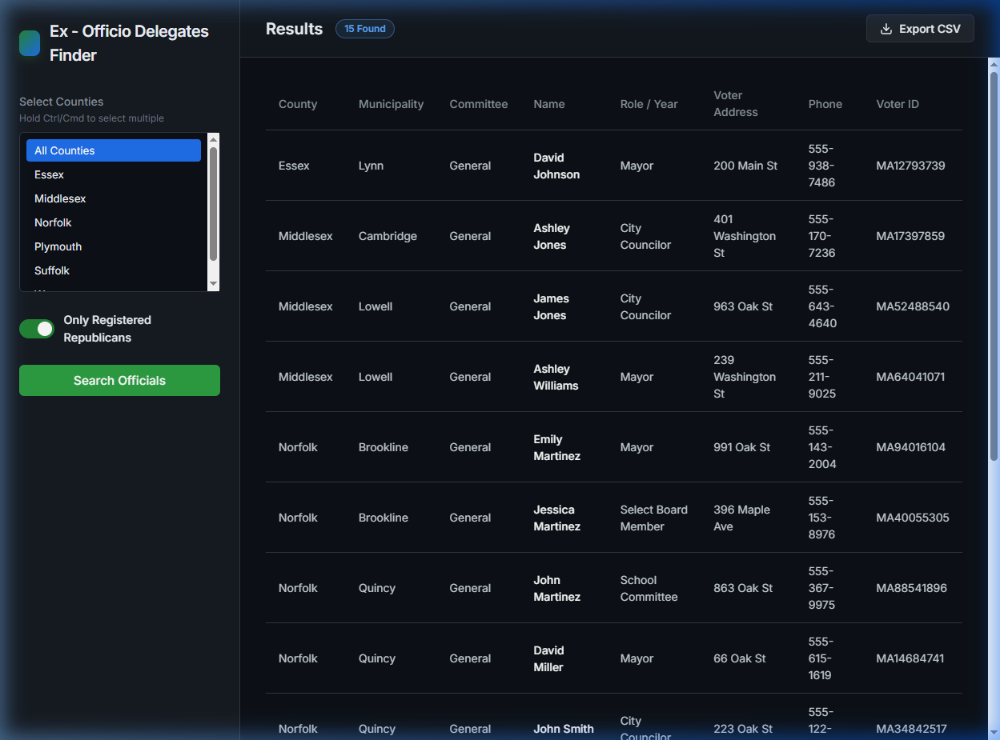

# MA Ex-Officio Delegates Finder

A powerful, high-performance local web application built to quickly cross-reference Massachusetts municipal elected officials against the registered Republican voter database. It allows filtering by County, finding exact matches, and exporting the detailed results straight to a CSV.



## Overview

This tool was designed for campaign research to identify which current elected municipal officials across all 351 MA cities and towns are also registered Republican voters. 

It works entirely locally using a Python Flask backend to load and process large datasets efficiently, and a modern, responsive HTML/JS frontend to provide a seamless user filtering experience.

## Features

- **County Filtering:** Select one, multiple, or all MA counties to narrow down the search pool.
- **Cross-Referencing Engine:** Instantly toggle between viewing all municipal officials vs only those who algorithmically match records in the MA Republican Voter List (matches based on First Name, Last Name, and City).
- **Fast Performance:** The Python backend caches the large datasets (spanning tens of thousands of rows) in memory on the first load, meaning subsequent searches and filter toggles are lightning fast.
- **Rich Data Export:** Download your exact filtered view into a fully formatted CSV file to import into Excel or Google Sheets. The export automatically includes enriched voter info (State Voter ID, Registered Address, Phone Number) when the Republican toggle is active.
- **Modern Interface:** A dark-mode, responsive user interface featuring micro-animations, loading states, and a sticky-header data table for easy browsing of hundreds of rows.

## Prerequisites

To run this application locally, you will need:
- **Python 3.8+** installed on your computer.

## Installation & Setup

1. **Clone the repository** to your local machine:
   ```bash
   git clone <your-repository-url>
   cd "MA Delegates Finder"
   ```

2. **Install the required Python packages** (it's recommended to do this within a virtual environment, though it's optional):
   ```bash
   pip install -r requirements.txt
   ```

## Running the Application

There are two ways to start the application:

### The Easy Way (Windows)
Simply double-click the `run_app.bat` file located in the folder. A terminal window will open, automatically start the server, and keep it running.

### The Manual Way (Mac/Linux/Windows Terminal)
Open your terminal in the project folder and run:
   ```bash
   python app.py
   ```

**Once the server is running**, open your web browser and navigate to:
`http://127.0.0.1:5000`

> Note: The very first time you click "Search Officials", it may take a few seconds as the application loads and caches the large data files into memory. All future searches while the server is running will be nearly instant.

## Troubleshooting

- **TemplateNotFound Error:** Make sure you are running the `app.py` script from the actual project folder and not from a different directory, so it can properly find the `templates` and `static` folders.
- **Ghost Server:** If the terminal crashes or you close it forcefully, the server might stay running in the background quietly holding onto port `5000`. You can kill it via Task Manager or terminal (`taskkill /F /IM python.exe /T` on Windows) to free the port for a new session.
